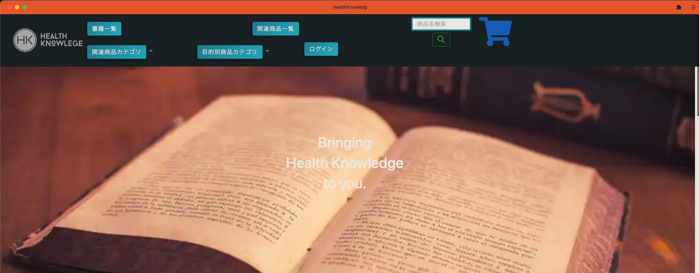
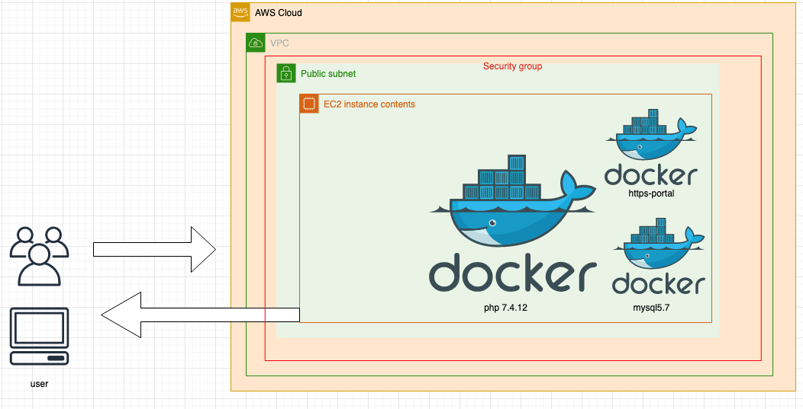
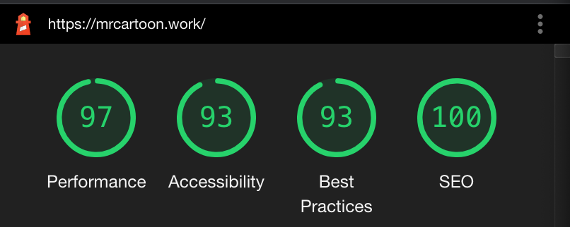

# portforio

phpフルスクラッチECサイト

パレオな男　鈴木裕著の本購入サイトとそれに付随した商品の購入サイト

デプロイ先は<a href="https://mrcartoon.work/">こちら</a>

<h2>画像ファイルを全てwebpにしておりますのでChromiumのブラウザで閲覧をお願いします</h2>

# EC_shop

<h3>作成機能（会員側） </h3>
・会員登録 
・会員削除機能 
・会員情報編集 
・住所登録の際の郵便番号から住所検索(ajax) 
・カート機能 
・カート内商品数量変更機能（jquery） 
・欲しい！（いいね）機能（ajax,jquery） 
・商品一覧画面 
・購入履歴機能（商品別詳細、個数、単価） 
・商品購入数量変更ボタン(jquery) 
・ページング機能 
・商品詳細画面 
・Bootstrapレイアウト　(カード表示がメイン) 
・関連おすすめ商品スライド機能(jquery) 
・問い合わせ機能 
・全商品から商品名での検索機能 

<h3>作成機能（管理側側） </h3>

・記事（トップニュース）管理機能 
・会員管理機能 
・受注管理、明細表示機能 
・書籍商品データ新規作成・編集・削除　機能 
・副商材商品データ新規作成・編集・削除　機能 

<h2>インフラ</h2>
・開発環境 M1 mac mini 
・dockerコンテナのみで作成(Linux,Apache,Mysql 5.7,php) 
・https-portalを使用した,SSL化での稼働 
・AWSのEC2内のdockerコンテナのみで稼働 
・EC2のスワップメモリを4GB設定中 

<h2>オプション</h2>
・ServiceWorkerを使用して、簡易的なPWAの設定（デスクトップ、ホーム画面追加）

